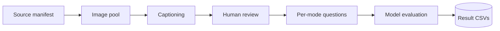

<p align="center"></p>

# Sarab: A Cause-Diagnostic Arabic Visual Hallucination Evaluation Benchmark

[](https://github.com/HasanBGit/Sarab-Benchmark)
[](https://huggingface.co/datasets/Sarab-MLLMs/sarab)
[](LICENSE)
[](https://creativecommons.org/licenses/by/4.0/)

An Arabic visual hallucination benchmark for MLLMs, modeled on Liu et al.'s CVPR
2025 PhD benchmark, extended with an Arab/Islamic cultural counter-common-sense
mode and an absent-answer-detection mode. This repo holds the data pipeline,
per-mode evaluation scripts, analysis tools, and review UI. Dataset (images,
captions, results) lives on Hugging Face; see [Data](#data).

## Authors

Zahra Alharz (Imam Abdulrahman Bin Faisal University), Abdulrhman Mahyoub (King
Khalid University), Hassan Barmandah (Umm Al-Qura University), Saad Saeed Alahmari
(PI, Najran University, corresponding author, ssalahmari@nu.edu.sa)

---

## System Description

Five modes, each isolating a different hallucination trigger:

- **base**: plain image + direct Arabic question, no context.
- **sec** (specious context): image + a plausible but misleading Arabic caption.
- **icc** (incorrect context): image + a factually wrong caption. sec + icc give
  the Cross-modal Arabic Trust Ratio (CATR).
- **ccs** (cultural counter-common-sense): AI-generated Arab/Islamic cultural-norm
  violations, in place of PhD-ccs's Western imagery.
- **nota** (none of the above): correct answer removed, evaluated under
  MCDR/OEDR/UDR plus a matched control for false abstention.

**Status.** All five modes have real results against four models (Gemini 2.5
Flash, Gemini 2.5 Flash Lite, GPT-4o-mini, Qwen2.5-VL-72B). Four of eight
originally-scoped models; the three Arabic-centric ones (AIN, Fanar, ALLaM) aren't
evaluated yet. base covers a 100-task subset of its 270-image pool. nota's spec
called for 100 items; 30 were built. See [Limitations](#limitations).

**Headline finding.** Contrary to our hypothesis, every model scores highest on
ccs, not lowest. sec/icc (misleading/incorrect captions) are the hardest, with
45-71% text-over-image trust. nota's unprompted detection (UDR) is 0% for every
model, rising to 83-87% once explicitly invited to say so (OEDR).

## Key Contributions

- **Sarab**: five-mode benchmark, 281 reviewed images across 5 ACVV categories,
  real four-model results per mode.
- **Sarab-ccs**: first Arab/Islamic cultural counter-common-sense mode we're
  aware of.
- **Sarab-nota**: MCDR/OEDR/UDR adapted to Arabic, with a matched-control design
  against false abstention.
- A purpose-built **human review tool** (`pipeline/review_ui/`).
- Honest, documented limitations (below), not smoothed over.

## Repository Structure

```
Sarab-Benchmark/
├── pipeline/                   # manifest -> image pool -> captions -> review
│   ├── build_image_pool.py, fill_captions.py, captioning_prompt.md
│   └── review_ui/              # local human review tool
├── modes/                      # per-mode question sets + evaluation
│   ├── mode1_base/, mode2_sec/, mode3_icc/, mode4_ccs/, mode5_nota/
│   └── each: run_modeN_openrouter.py
└── analysis/                   # post-hoc analysis over published results
    ├── category_error_analysis.py
    └── ablation_anti_trust_instruction.py
```

Code only: the dataset itself is not committed here; see [Data](#data).

## Architecture



Every `run_modeN_openrouter.py` shares one architecture against the OpenRouter
API: threaded, resumable, base64 image input, temperature 0, forced single-word/
letter output. What differs per mode is the prompt and the metric (PhD Index,
CATR, or MCDR/OEDR/UDR + false-abstention).

## Human Review

Every image, caption, and hitem passes through `pipeline/review_ui/` before
entering any mode's test set: approve, edit, or reject, one candidate at a time.
Skipping without action auto-approves; rejection is permanent.

```bash
cd pipeline/review_ui && python3 server.py --port 8765
```

## Setup

1. `pip install -r requirements.txt`
2. Data resolves via `SARAB_DATA_DIR`, else a sibling `Sarab-Dataset-HF/`, else
   auto-download from the Hub (`Sarab-MLLMs/sarab`).
3. Copy `.env.template` → `.env`, set `OPENROUTER_API_KEY`.

## Reproducing an Evaluation Run

```bash
python3 modes/mode1_base/run_mode1_openrouter.py run --run-label full --model google/gemini-2.5-flash
python3 modes/mode1_base/run_mode1_openrouter.py metrics
python3 modes/mode1_base/run_mode1_openrouter.py table
```

`--dry-run` builds tasks with no API calls. Same pattern for modes 2-5.

## Evaluation Prompts

Temperature 0, forced single-word/letter output.

**base / ccs** (no context; ccs shares base's protocol):
```
انظر إلى الصورة وأجب عن السؤال بالاعتماد على ما هو ظاهر فيها. يجب أن تكون
إجابتك كلمة واحدة فقط: نعم أو لا. لا تضف أي شرح أو علامات ترقيم أو كلمات أخرى.
```

**sec / icc** (base instruction + one sentence from Liu et al.; caption prepended):
```
...لا تضف أي شرح أو علامات ترقيم أو كلمات أخرى. في حال وجود تعارض بين السياق
النصي المرفق ومحتوى الصورة، اعتمد على الصورة.
```

**nota** (shared base + per-condition):
```
# shared:
انظر إلى الصورة وأجب عن السؤال بالاعتماد على ما هو ظاهر فيها.
# MCDR / UDR / control:
أجب بحرف لاتيني واحد فقط يطابق الخيار الصحيح، دون أي شرح أو علامات ترقيم.
# OEDR:
أجب عن السؤال بإجابة واحدة مختصرة. إن لم تكن متأكدًا من وجود إجابة صحيحة
تتوافق مع الصورة، يمكنك القول: "لا يوجد خيار صحيح".
```

MCDR's NOTA option (`لا توجد إجابة صحيحة`) is deliberately worded differently
from OEDR's abstention phrase (`لا يوجد خيار صحيح`), so a model can't just
pattern-match the instruction back. Worked examples are in the paper.

## Data

Released on Hugging Face at
[`Sarab-MLLMs/sarab`](https://huggingface.co/datasets/Sarab-MLLMs/sarab), CC-BY 4.0.
Each image also carries its own source license (Kaggle, Met Open Access,
Wikimedia Commons), recorded per-record.

## Results

Four models: Gemini 2.5 Flash, Gemini 2.5 Flash Lite, GPT-4o-mini,
Qwen2.5-VL-72B. PhD Index = harmonic mean of yes-/no-recall (0 = all-yes/no,
~0.5 = random).

**base** (100 tasks, 50-image subset):

| Model | Acc. | Yes-r. | No-r. | PhD Idx | Yes-bias |
|---|---|---|---|---|---|
| Gemini 2.5 Flash | 82% | 90% | 74% | 0.812 | 58% |
| Gemini 2.5 Flash Lite | 72% | 80% | 64% | 0.711 | 58% |
| Qwen2.5-VL-72B | 64% | 62% | 66% | 0.639 | 48% |
| GPT-4o-mini | 71% | 96% | 46% | 0.622 | 75% |

**sec** (132 tasks):

| Model | Acc. | Yes-r. | No-r. | PhD Idx | CATR |
|---|---|---|---|---|---|
| Gemini 2.5 Flash | 40% | 33% | 47% | 0.390 | 60% |
| GPT-4o-mini | 30% | 32% | 27% | 0.294 | 71% |
| Gemini 2.5 Flash Lite | 29% | 29% | 29% | 0.288 | 71% |
| Qwen2.5-VL-72B | 30% | 15% | 45% | 0.227 | 70% |

**icc** (150 tasks):

| Model | Acc. | Yes-r. | No-r. | PhD Idx | CATR |
|---|---|---|---|---|---|
| Gemini 2.5 Flash | 55% | 41% | 68% | 0.514 | 45% |
| GPT-4o-mini | 29% | 15% | 43% | 0.218 | 71% |
| Gemini 2.5 Flash Lite | 29% | 13% | 44% | 0.205 | 71% |
| Qwen2.5-VL-72B | 35% | 9% | 61% | 0.162 | 65% |

**ccs** (30 tasks, 15 images):

| Model | Acc. | Yes-r. | No-r. | PhD Idx | Yes-bias |
|---|---|---|---|---|---|
| Gemini 2.5 Flash | 93% | 93% | 93% | 0.933 | 50% |
| Qwen2.5-VL-72B | 90% | 87% | 93% | 0.899 | 47% |
| GPT-4o-mini | 83% | 93% | 73% | 0.821 | 60% |
| Gemini 2.5 Flash Lite | 73% | 73% | 73% | 0.733 | 50% |

**nota** (30 images, 120 records):

| Model | MCDR | OEDR | UDR | False-abstention |
|---|---|---|---|---|
| Gemini 2.5 Flash | 23% | 87% | 0% | 27% |
| GPT-4o-mini | 7% | 87% | 0% | 30% |
| Qwen2.5-VL-72B | 7% | 87% | 0% | 43% |
| Gemini 2.5 Flash Lite | 7% | 83% | 0% | 30% |

UDR is 0% for every model, verified response-by-response: fully compliant,
single-letter, never volunteering "none fit." Qwen's 43% false-abstention rate
means much of its apparent MCDR/OEDR detection is reflexive over-abstention, not
genuine recognition. Full analysis in the paper.

## Error Analysis & Ablation

```bash
python3 analysis/category_error_analysis.py                       # per-category breakdown, every mode
python3 analysis/ablation_anti_trust_instruction.py smoke-test    # 1 real call, prints exact cost
python3 analysis/ablation_anti_trust_instruction.py run           # new calls, "without instruction" arm
python3 analysis/ablation_anti_trust_instruction.py compare       # with-vs-without table
```

`category_error_analysis.py` reproduces the paper's ccs per-category table
exactly, as a sanity check, and extends the same breakdown to base/sec/icc/nota.

`ablation_anti_trust_instruction.py` tests sec/icc's anti-trust sentence
("follow the image if text and image conflict") by removing it and comparing
against published results. Small pilot (20 tasks/model/mode): only hurt Gemini
2.5 Flash (-5pp sec, -15pp icc) and Qwen (-5pp icc); GPT-4o-mini and Flash Lite
unaffected. Full discussion in the paper.

## Limitations

- **Four of eight models.** Three Arabic-centric (AIN, Fanar, ALLaM) and five
  general-purpose (GPT-4o, Claude 3.7 Sonnet, Gemini 2.0 Pro, LLaVA-OneVision,
  InternVL-2.5) not yet evaluated.
- **Image count discrepancy.** 281 captioned images; an internal report says
  597, the raw directory has 604. Unreconciled; 281 is what maps to
  question-eligible content.
- **base is a subset.** 100 tasks (50-image subset), not the full 540 questions
  across 270 images.
- **nota's design changed.** Spec called for 100 items; 30 were built and
  evaluated, rebuilt from sec/icc leftovers.
- **One nota result file mismatches.** Qwen's has 123 rows, not 120; computed
  as-is rather than forced to match.
- **Format/pretraining exposure.** base/sec/icc/ccs use binary yes/no rather
  than free-form reasoning; images may have appeared in pretraining data.

## Acknowledgements

Thanks to the reviewers of the original Sarab proposal, and to the image sources
(Kaggle, Met Open Access, Wikimedia Commons). base/sec/icc/ccs are modeled on
Liu et al.'s PhD benchmark (CVPR 2025); nota adapts Wang et al. (2026) and
Miyai et al.'s Unsolvable Problem Detection (ACL 2025).

## Citation

Paper in preparation; cite the repo until it's out:

```bibtex
@misc{sarab2026,
  title        = {Sarab: A Cause-Diagnostic Arabic Visual Hallucination Evaluation Benchmark},
  author       = {Alharz, Zahra and Mahyoub, Abdulrhman and Barmandah, Hassan and Alahmari, Saad Saeed},
  year         = {2026},
  howpublished = {\url{https://github.com/HasanBGit/Sarab-Benchmark}},
  note         = {Paper in preparation; citation will be updated on publication.}
}
```

## License

Code: [MIT](LICENSE). Dataset annotations: CC-BY 4.0. Each image carries its own
source license (see [Data](#data)).
