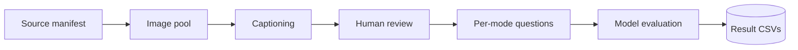

<p align="center"></p>

# Sarab: A Cause-Diagnostic Arabic Visual Hallucination Evaluation Benchmark

[](https://github.com/HasanBGit/Sarab-Benchmark)
[](https://huggingface.co/datasets/Sarab-MLLMs/sarab)
[](LICENSE)
[](https://creativecommons.org/licenses/by/4.0/)

An Arabic visual hallucination benchmark for MLLMs, with an Arab/Islamic
cultural counter-common-sense mode and an absent-answer-detection mode. This
repo holds the data pipeline, per-mode evaluation scripts, analysis tools, and
review UI. Dataset (images, captions, results) lives on Hugging Face; see
[Data](#data).

## Authors

Zahra Alharz (Imam Abdulrahman Bin Faisal University), Abdulrhman Mahyoub (King
Khalid University), Hassan Barmandah (Umm Al-Qura University), Saad Saeed Alahmari
(PI, Najran University, corresponding author, ssalahmari@nu.edu.sa)

---

## Five modes, five root causes

- **base**: plain image + direct Arabic question, no context.
- **sec** (specious context): image + a plausible but misleading Arabic caption.
- **icc** (incorrect context): image + a factually wrong caption. sec + icc give
  the Cross-modal Arabic Trust Ratio (CATR).
- **ccs** (cultural counter-common-sense): AI-generated Arab/Islamic cultural-norm
  violations.
- **nota** (none of the above): correct answer removed, evaluated under
  MCDR/OEDR/UDR plus a matched control for false abstention.

## Repository Structure

```
Sarab-Benchmark/
├── pipeline/                   # manifest -> image pool -> captions -> review
│   ├── build_image_pool.py, fill_captions.py, captioning_prompt.md
│   └── review_ui/              # local human review tool
├── modes/                      # per-mode question sets + evaluation
│   ├── mode1_base/, mode2_sec/, mode3_icc/, mode4_ccs/, mode5_nota/
│   └── each: run_modeN_openrouter.py
└── analysis/                   # post-hoc analysis tools
    ├── category_error_analysis.py
    └── ablation_anti_trust_instruction.py
```

Code only: the dataset itself is not committed here; see [Data](#data).

## Architecture



Every `run_modeN_openrouter.py` shares one architecture against the OpenRouter
API: threaded, resumable, base64 image input, temperature 0, forced single-word/
letter output. What differs per mode is the prompt and the metric.

## Human Review

Every image, caption, and hitem passes through `pipeline/review_ui/` before
entering any mode's test set: approve, edit, or reject, one candidate at a time.
Skipping without action auto-approves; rejection is permanent.

```bash
cd pipeline/review_ui && python3 server.py --port 8765
```

## Setup

1. `pip install -r requirements.txt`
2. Data resolves via `SARAB_DATA_DIR`, else a sibling `Sarab-Dataset-HF/`, else
   auto-download from the Hub (`Sarab-MLLMs/sarab`).
3. Copy `.env.template` → `.env`, set `OPENROUTER_API_KEY`.

## Reproducing an Evaluation Run

```bash
python3 modes/mode1_base/run_mode1_openrouter.py run --run-label full --model google/gemini-2.5-flash
python3 modes/mode1_base/run_mode1_openrouter.py metrics
python3 modes/mode1_base/run_mode1_openrouter.py table
```

`--dry-run` builds tasks with no API calls. Same pattern for modes 2-5.

## Evaluation Prompts

Temperature 0, forced single-word/letter output.

**base / ccs** (no context; ccs shares base's protocol):
```
انظر إلى الصورة وأجب عن السؤال بالاعتماد على ما هو ظاهر فيها. يجب أن تكون
إجابتك كلمة واحدة فقط: نعم أو لا. لا تضف أي شرح أو علامات ترقيم أو كلمات أخرى.
```

**sec / icc** (base instruction + one added anti-trust sentence; caption prepended):
```
...لا تضف أي شرح أو علامات ترقيم أو كلمات أخرى. في حال وجود تعارض بين السياق
النصي المرفق ومحتوى الصورة، اعتمد على الصورة.
```

**nota** (shared base + per-condition):
```
# shared:
انظر إلى الصورة وأجب عن السؤال بالاعتماد على ما هو ظاهر فيها.
# MCDR / UDR / control:
أجب بحرف لاتيني واحد فقط يطابق الخيار الصحيح، دون أي شرح أو علامات ترقيم.
# OEDR:
أجب عن السؤال بإجابة واحدة مختصرة. إن لم تكن متأكدًا من وجود إجابة صحيحة
تتوافق مع الصورة، يمكنك القول: "لا يوجد خيار صحيح".
```

MCDR's NOTA option (`لا توجد إجابة صحيحة`) is deliberately worded differently
from OEDR's abstention phrase (`لا يوجد خيار صحيح`), so a model can't just
pattern-match the instruction back.

## Data

Released on Hugging Face at
[`Sarab-MLLMs/sarab`](https://huggingface.co/datasets/Sarab-MLLMs/sarab), CC-BY 4.0.
Each image also carries its own source license (Kaggle, Met Open Access,
Wikimedia Commons), recorded per-record.

## Analysis Tools

```bash
python3 analysis/category_error_analysis.py                       # per-category breakdown, every mode
python3 analysis/ablation_anti_trust_instruction.py smoke-test    # 1 real call, prints exact cost
python3 analysis/ablation_anti_trust_instruction.py run           # new calls, "without instruction" arm
python3 analysis/ablation_anti_trust_instruction.py compare       # with-vs-without table
```

## Acknowledgements

Thanks to the reviewers of the original Sarab proposal, and to the image sources
(Kaggle, Met Open Access, Wikimedia Commons). nota adapts Wang et al. (2026)
and Miyai et al.'s Unsolvable Problem Detection (ACL 2025).

## Citation

Paper in preparation; cite the repo until it's out:

```bibtex
@misc{sarab2026,
  title        = {Sarab: A Cause-Diagnostic Arabic Visual Hallucination Evaluation Benchmark},
  author       = {Alharz, Zahra and Mahyoub, Abdulrhman and Barmandah, Hassan and Alahmari, Saad Saeed},
  year         = {2026},
  howpublished = {\url{https://github.com/HasanBGit/Sarab-Benchmark}},
  note         = {Paper in preparation; citation will be updated on publication.}
}
```

## License

Code: [MIT](LICENSE). Dataset annotations: CC-BY 4.0. Each image carries its own
source license (see [Data](#data)).
