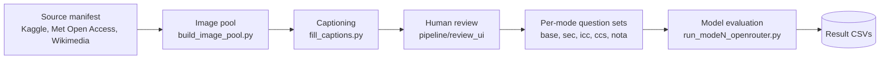

# Sarab: A Cause-Diagnostic Arabic Visual Hallucination Evaluation Benchmark

[](https://github.com/HasanBGit/Sarab-Benchmark)
[](https://huggingface.co/datasets/HassanB4/sarab)
[](LICENSE)
[](https://creativecommons.org/licenses/by/4.0/)

A cause-diagnostic Arabic visual hallucination evaluation benchmark for multimodal
large language models (MLLMs), modeled on Liu et al.'s CVPR 2025 PhD benchmark and
extended with an Arab and Islamic cultural counter-common-sense mode and an
absent-answer-detection mode that PhD itself does not have. This repository holds
the data pipeline, per-mode evaluation scripts, and human review tool. The
underlying dataset (images, captions, hitems, and per-mode question and result
files) lives on Hugging Face; see [Data](#data).

## Authors

Zahra Alharz (Imam Abdulrahman Bin Faisal University), Abdulrhman Mahyoub (King
Khalid University), Hassan Barmandah (Department of Software Engineering, Umm
Al-Qura University), Saad Saeed Alahmari (Principal Investigator, Najran
University, corresponding author, ssalahmari@nu.edu.sa)

---

## System Description

Sarab evaluates a model across five modes, each isolating a different
hallucination trigger, following the three-cause taxonomy PhD introduced (visual
ambiguity, multimodal inconsistency, counter-common-sense priors) plus a fourth
failure mode PhD does not test, forced-choice bias under an absent correct answer.

- **base**: a plain image and a direct Arabic question, no context text.
- **sec** (specious context): a plausible but misleading Arabic caption accompanies
  the image.
- **icc** (incorrect context): the caption is factually wrong rather than merely
  misleading; sec and icc together give the Cross-modal Arabic Trust Ratio (CATR).
- **ccs** (cultural counter-common-sense): AI-generated images depicting Arab or
  Islamic cultural-norm violations, the first Arabic-native counter-common-sense
  mode we are aware of, in place of PhD-ccs's Western imagery (square-wheeled cars,
  oversized mice).
- **nota** (none of the above): identity-naming items with the correct answer
  removed, evaluated under three conditions (MCDR, OEDR, UDR) and paired with a
  matched control to separate genuine absence detection from reflexive
  over-abstention.

**Status, honestly.** All five modes are built and have real, OpenRouter-evaluated
results against four models (two Gemini 2.5 variants, GPT-4o-mini, and
Qwen2.5-VL-72B-Instruct). This is four of the eight models scoped in the original
research proposal; none of the three Arabic-centric models (AIN, Fanar, ALLaM) have
been evaluated yet, and that is the single most important gap to close next. base's
result files cover a 100-task subset of its full 270-image pool, not the whole
pool. nota's design specification called for 100 unique-identity items; the version
actually built and evaluated has 30, rebuilt from the sec/icc candidates left over
after those two modes' test sets were exported. Every one of these gaps is written
up in [Limitations](#limitations) below, not smoothed over.

Contrary to our own pre-registered hypothesis that ccs would be the hardest mode
(mirroring PhD's own finding for its Western CCS imagery), every model in our
results scores its **highest** PhD Index on ccs. sec and icc, where a misleading or
incorrect Arabic caption accompanies the image, are consistently the hardest, with
models following the text over the image 45 to 71 percent of the time. Under nota,
unprompted absent-answer detection (UDR) is a flat 0 percent across all four
models, rising to 83 to 87 percent only once the model is explicitly told that no
option may be correct (OEDR). See [Results](#results) for the full numbers.

## Key Contributions

- **Sarab**, a five-mode Arabic visual hallucination evaluation benchmark built
  on a reviewed, human-captioned pool of 281 images across five Arabic Cultural
  Visual Vocabulary (ACVV) categories (traditional attire, cuisine, architecture,
  cultural objects, Arabic script), with real four-model results for every mode.
- **Sarab-ccs**, an Arab and Islamic cultural counter-common-sense mode: sacred-
  space violations, religious and attire contradictions, seasonal and holiday
  context mixing, sacred-text and OCR hijacking, historical anachronisms, and
  tashkeel-diacritic contrasts.
- **Sarab-nota**, an absent-answer-detection mode adapting the MCDR/OEDR/UDR
  protocol to Arabic images, with a matched-control design that catches
  reflexive over-abstention rather than crediting it as genuine detection.
- A purpose-built **human review tool** (`pipeline/review_ui/`) used to vet every
  image, caption, and hitem before it can enter any mode's test set.
- **An honest accounting of what is not yet done.** See Limitations.

## Repository Structure

```
Sarab-Benchmark/
├── README.md                  # this file
├── LICENSE                    # MIT (code only; each image carries its own source
│                               #   license, recorded per-image in the dataset)
├── requirements.txt
├── pipeline/                  # stage 1: manifest -> image pool -> captions
│   ├── build_image_pool.py    # merge manifest_unified.csv into image_pool.json
│   ├── fill_captions.py       # caption-filling control layer (batches/, status)
│   ├── captioning_prompt.md   # the captioning specification
│   └── review_ui/             # local human review tool (Section below)
│       ├── server.py, index.html, app.js, style.css
└── modes/                      # stage 2: per-mode question sets + evaluation
    ├── mode1_base/run_mode1_openrouter.py
    ├── mode2_sec/run_mode2_openrouter.py
    ├── mode3_icc/run_mode3_openrouter.py
    ├── mode4_ccs/run_mode4_openrouter.py
    └── mode5_nota/{run_mode5_openrouter.py, fill_nota_questions.py, nota_question_prompt.md}
```

This repo is code only. The dataset itself (images, candidate pools, per-mode
question sets, and result CSVs) and the small reference samples from the two
benchmarks Sarab's modes are modeled on (PhD, Liu et al. 2025; MM-UPD, Miyai
et al. 2025) are not committed here; see [Data](#data).

## Architecture



Every mode's evaluation script (`run_modeN_openrouter.py`) shares the same
architecture against the OpenRouter API: threaded, concurrent requests; a
resumable design that retries only unfinished or non-permanent-error tasks by
task id, not restarting a run from scratch; base64-encoded local images sent
as vision input; temperature 0; and a forced, single-word or single-letter
output contract. What differs per mode is the prompt (see
[Evaluation Prompts](#evaluation-prompts)) and the metric computed
(PhD Index for base/sec/icc/ccs, CATR for sec/icc, MCDR/OEDR/UDR and
false-abstention for nota).

## Human Review

Every image, together with its Arabic caption and hitem, passes through the
review tool in `pipeline/review_ui/` before it is eligible to enter any mode's test
set. The tool shows one candidate at a time (image, category, country metadata,
Arabic caption and hitem text) and lets a reviewer approve, edit, or reject it in
place; advancing without an explicit edit or rejection auto-approves the current
record, and a rejected record is permanently excluded from the merged, promotable
pool. This review process is applied uniformly by the project team across every
one of the five modes' candidate data, not delegated to a single reviewer's slice
of the pool.

```bash
cd pipeline/review_ui
python3 server.py --port 8765
# open http://127.0.0.1:8765/
```

## Setup

1. `pip install -r requirements.txt` (only `requests`, plus `huggingface_hub` if
   you are pulling the dataset straight from the Hub rather than a local copy).
2. Get the data. The evaluation and pipeline scripts resolve it in this order:
   - `SARAB_DATA_DIR` environment variable, if set, pointing at a local checkout.
   - A sibling `Sarab-Dataset-HF/` directory next to this repo (useful for local
     development against an unpublished or in-progress copy).
   - Otherwise, downloaded and cached automatically from the Hugging Face dataset
     (`HassanB4/sarab`) the first time a script runs.
3. Copy `.env.template` to `.env` (repo root) and set `OPENROUTER_API_KEY`; every
   mode's evaluation script authenticates against OpenRouter with this one key.

## Reproducing an Evaluation Run

Each mode's script shares the same `run` / `metrics` / `table` subcommand
structure, threaded and resumable (retrying only unfinished or non-permanent-error
tasks by task id, not restarting a run from scratch):

```bash
python3 modes/mode1_base/run_mode1_openrouter.py run --run-label full --model google/gemini-2.5-flash
python3 modes/mode1_base/run_mode1_openrouter.py metrics
python3 modes/mode1_base/run_mode1_openrouter.py table
```

`--dry-run` builds the task list and prints counts with no API calls, useful for
verifying the data path resolved correctly before spending anything on inference.
The same pattern applies to `modes/mode2_sec`, `modes/mode3_icc`,
`modes/mode4_ccs`, and `modes/mode5_nota`.

## Evaluation Prompts

The exact Arabic system instructions used by every mode, reproduced verbatim
from the evaluation scripts. All are used at temperature 0 with a forced
single-word or single-letter output contract.

**base and ccs** (no context text; ccs shares base's protocol exactly):

```
انظر إلى الصورة وأجب عن السؤال بالاعتماد على ما هو ظاهر فيها. يجب أن تكون
إجابتك كلمة واحدة فقط: نعم أو لا. لا تضف أي شرح أو علامات ترقيم أو كلمات أخرى.
```

**sec and icc** (the base instruction above, plus one sentence verbatim from
Liu et al.'s own sec/icc instruction; the misleading or incorrect Arabic
caption is then prepended to the question):

```
...لا تضف أي شرح أو علامات ترقيم أو كلمات أخرى. في حال وجود تعارض بين السياق
النصي المرفق ومحتوى الصورة، اعتمد على الصورة.
```

**nota**, a shared base instruction plus a per-condition instruction:

```
# shared:
انظر إلى الصورة وأجب عن السؤال بالاعتماد على ما هو ظاهر فيها.

# MCDR / UDR / matched control (lettered multiple choice):
أجب بحرف لاتيني واحد فقط يطابق الخيار الصحيح، دون أي شرح أو علامات ترقيم.

# OEDR (no options shown):
أجب عن السؤال بإجابة واحدة مختصرة. إن لم تكن متأكدًا من وجود إجابة صحيحة
تتوافق مع الصورة، يمكنك القول: "لا يوجد خيار صحيح".
```

The NOTA option text shown as a lettered choice under MCDR and the matched
control is `لا توجد إجابة صحيحة`, deliberately a different phrase from the
OEDR instruction's `لا يوجد خيار صحيح`; the two are not normalized into one
phrase, so a model's response cannot simply pattern-match the instruction
text back at the evaluator. The full worked example (a nota item under all
three conditions plus its matched control) is in the paper (see
[Citation](#citation)).

## Data

The dataset (images, captions, hitems, per-mode question sets, and result CSVs) is
released on Hugging Face at
[`HassanB4/sarab`](https://huggingface.co/datasets/HassanB4/sarab) under
CC-BY 4.0. Each image also carries its own source license (a mix of MIT,
Apache-2.0, CC0, CC-BY, and CC-BY-SA, from Kaggle collections, The Metropolitan
Museum of Art's Open Access API, and Wikimedia Commons), recorded per-record in the
dataset. See the dataset card for the full per-mode JSON schema.

## Results

Full per-mode results across all four evaluated models (Gemini 2.5 Flash, Gemini
2.5 Flash Lite, GPT-4o-mini, Qwen2.5-VL-72B-Instruct). PhD Index is the harmonic
mean of yes-recall and no-recall (an all-yes or all-no model scores 0, random
guessing scores about 0.5).

**base** (100 tasks, 50-image subset of the full 270-image pool):

| Model | Acc. | Yes-r. | No-r. | PhD Idx | Yes-bias |
|---|---|---|---|---|---|
| Gemini 2.5 Flash | 82% | 90% | 74% | 0.812 | 58% |
| Gemini 2.5 Flash Lite | 72% | 80% | 64% | 0.711 | 58% |
| Qwen2.5-VL-72B | 64% | 62% | 66% | 0.639 | 48% |
| GPT-4o-mini | 71% | 96% | 46% | 0.622 | 75% |

**sec** (132 tasks):

| Model | Acc. | Yes-r. | No-r. | PhD Idx | CATR |
|---|---|---|---|---|---|
| Gemini 2.5 Flash | 40% | 33% | 47% | 0.390 | 60% |
| GPT-4o-mini | 30% | 32% | 27% | 0.294 | 71% |
| Gemini 2.5 Flash Lite | 29% | 29% | 29% | 0.288 | 71% |
| Qwen2.5-VL-72B | 30% | 15% | 45% | 0.227 | 70% |

**icc** (150 tasks):

| Model | Acc. | Yes-r. | No-r. | PhD Idx | CATR |
|---|---|---|---|---|---|
| Gemini 2.5 Flash | 55% | 41% | 68% | 0.514 | 45% |
| GPT-4o-mini | 29% | 15% | 43% | 0.218 | 71% |
| Gemini 2.5 Flash Lite | 29% | 13% | 44% | 0.205 | 71% |
| Qwen2.5-VL-72B | 35% | 9% | 61% | 0.162 | 65% |

**ccs** (30 tasks, 15 images):

| Model | Acc. | Yes-r. | No-r. | PhD Idx | Yes-bias |
|---|---|---|---|---|---|
| Gemini 2.5 Flash | 93% | 93% | 93% | 0.933 | 50% |
| Qwen2.5-VL-72B | 90% | 87% | 93% | 0.899 | 47% |
| GPT-4o-mini | 83% | 93% | 73% | 0.821 | 60% |
| Gemini 2.5 Flash Lite | 73% | 73% | 73% | 0.733 | 50% |

**nota** (30 images, 120 records: 30 × mcdr/oedr/udr + matched control):

| Model | MCDR | OEDR | UDR | False-abstention |
|---|---|---|---|---|
| Gemini 2.5 Flash | 23% | 87% | 0% | 27% |
| GPT-4o-mini | 7% | 87% | 0% | 30% |
| Qwen2.5-VL-72B | 7% | 87% | 0% | 43% |
| Gemini 2.5 Flash Lite | 7% | 83% | 0% | 30% |

UDR is a flat 0 percent for every model, verified at the raw-response level: all
120 responses are exactly a single letter (A, B, or C), fully compliant with the
instruction and never volunteering that none of the options fit. Detection rises
sharply once a model is explicitly invited to say so (MCDR, OEDR), but
Qwen2.5-VL-72B's 43 percent false-abstention rate shows a meaningful share of that
apparent detection is reflexive over-abstention rather than genuine recognition.

Full analysis, per-category ccs breakdown, and the evaluation prompts are in the
paper (see [Citation](#citation)).

## Limitations

- **Four of eight proposed models.** The original proposal scoped eight models,
  three Arabic-centric (AIN, Fanar, ALLaM) and five general-purpose (GPT-4o, Claude
  3.7 Sonnet, Gemini 2.0 Pro, LLaVA-OneVision, InternVL-2.5). Results here cover
  four different models reachable through a single OpenRouter key; none of the
  Arabic-centric models, arguably the most important comparison for the proposal's
  cultural-specialization hypotheses, have been evaluated yet.
- **Image count discrepancy.** The reviewed, captioned pool that every mode's
  questions are built from contains 281 images. A separate internal progress
  report states 597, and the raw image directory (including sourcing candidates
  that did not pass review) contains 604 files. These have not been reconciled;
  281 is the figure that maps to captioned, question-eligible content.
  Approximate per-category split: architecture 80, attire 21, cuisine 88, objects
  2, script 90.
- **base is evaluated on a subset.** Its result files are named as though they
  cover the full pool but contain 100 tasks (a common 50-image subset), not all
  540 questions across the full 270-image pool.
  Evaluating the remaining 170 images is the most direct next step for that mode.
- **nota's design changed after its specification was written.** The written spec
  describes selecting 100 unique-identity items; the version actually generated
  and evaluated has 30, rebuilt from the 50 sec/icc candidates not exported into
  either mode's test set, deduplicated by unique identity. The 30-item set is what
  is reported throughout; the 100-item design is superseded, not silently dropped.
- **One model's nota result count does not match the others.** Three of four
  models' nota result files have exactly 120 rows, matching the question set.
  Qwen2.5-VL-72B's has 123, most likely un-deduplicated retries from a resumed run.
  We compute its metrics from the actual 123-row file rather than forcing a false
  parity across models.
- **Format and pretraining exposure.** Following PhD's own framing, base, sec,
  icc, and ccs use a binary yes/no format rather than free-form reasoning, and
  images are drawn from generally available sources some evaluated models may have
  encountered during pretraining; this isolates hallucination from raw
  incapability rather than eliminating all possible prior exposure.

## Acknowledgements

We thank the reviewers of the original Sarab proposal for their feedback on the
benchmark's design, and acknowledge the openly licensed image sources used
throughout: Kaggle collections, The Metropolitan Museum of Art's Open Access API,
and Wikimedia Commons. Sarab's base/sec/icc/ccs modes are modeled on Liu et al.'s
PhD benchmark (CVPR 2025); its nota mode adapts the absent-answer-detection
protocol from Wang et al. (2026) and the Unsolvable Problem Detection methodology
from Miyai et al. (ACL 2025).

## Citation

The full system-description paper, including per-category ccs analysis, the
complete evaluation prompts, and the human review methodology, is in preparation.
This entry will be replaced with the paper's own citation once it is available;
in the meantime, please cite the repository directly:

```bibtex
@misc{sarab2026,
  title        = {Sarab: A Cause-Diagnostic Arabic Visual Hallucination Evaluation Benchmark},
  author       = {Alharz, Zahra and Mahyoub, Abdulrhman and Barmandah, Hassan and Alahmari, Saad Saeed},
  year         = {2026},
  howpublished = {\url{https://github.com/HasanBGit/Sarab-Benchmark}},
  note         = {Paper in preparation; citation will be updated on publication.}
}
```

## License

Code is released under the [MIT License](LICENSE). Each image in the dataset
carries its own source license (see [Data](#data)); the dataset's own annotations
(captions, hitems, questions) are released under CC-BY 4.0.
